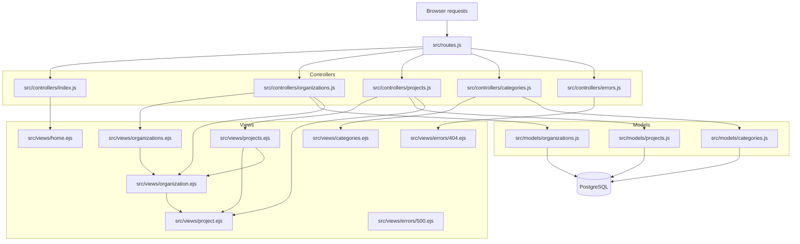

# Changes Log

## Task Summary
Added a new service project details page at `/project/:id` and connected it to the existing project listing so each project title can open its own detail view.

## What Changed

### 1. New project detail route
- Added a new Express route in `src/routes.js` for `/project/:id`.
- Wired that route to a new controller function so requests for a specific project id are handled separately from the main projects list.

### 2. New project detail controller logic
- Updated `src/controllers/projects.js` to import a new model function for fetching a single project.
- Added `showProjectDetailsPage` to:
  - read the project id from `req.params.id`
  - fetch the project record from the database
  - return a 404 error when no project is found
  - render a new `project` view with the project data when the record exists

### 3. New project detail database query
- Expanded `src/models/projects.js` with a `getProjectDetails` function.
- The query now returns:
  - project id
  - organization id
  - title
  - description
  - location
  - project date
  - organization name
  - organization logo filename
  - a comma-separated list of project categories
- The query joins:
  - `projects`
  - `organization`
  - `project_categories`
  - `categories`
- A `GROUP BY` was used so the category list can be aggregated cleanly with `STRING_AGG`.
- If no project is found, the function returns `null`.

### 4. Updated project listing view
- Modified `src/views/projects.ejs` so each project title links to its detail page.
- The list still shows the formatted project date and organization name, but now users can click into a full project record.

### 5. New project detail view
- Added `src/views/project.ejs`.
- The page displays:
  - project title
  - organization name with a link back to the organization page
  - organization logo, if available
  - formatted project date
  - location
  - description
  - categories

## Behavior Added
- Visiting `/projects` now provides navigation into individual project pages.
- Visiting `/project/:id` shows a full service project profile.
- Missing or invalid project ids now trigger a 404 instead of rendering empty content.

## Validation
- Ran file-level error checks on the touched route, controller, model, and view files.
- No errors were reported in the modified files.

## Follow-up Update

### 6. Limited the main project listing to the next five upcoming projects
- Updated the `getAllProjects` query in `src/models/projects.js` so the main `/projects` page only returns projects with a `project_date` on or after the current date.
- Added `ORDER BY p.project_date` and `LIMIT 5` so the page shows the five soonest upcoming projects instead of the full list.

### 7. Added organization navigation to the project listing
- Updated `src/views/projects.ejs` so each project row now includes a link to its organization details page.
- The service project title continues to link to the project details page, so each row now supports navigation to both the service project and its parent organization.

## Project Wiring Diagram

## Function Reference

### Controllers
- `showHomePage` in `src/controllers/index.js` builds the home page response by setting the page title to `Home` and rendering `home.ejs`.
- `showOrganizationsPage` in `src/controllers/organizations.js` loads every organization from the database, sets the title to `Our Partner Organizations`, and renders `organizations.ejs` with the organization list.
- `showOrganizationDetailsPage` in `src/controllers/organizations.js` reads `req.params.id`, fetches one organization plus its related projects, sets the title to `Organization Details`, and renders `organization.ejs` with both data sets.
- `showProjectsPage` in `src/controllers/projects.js` calls `getUpcomingProjects(NUMBER_OF_UPCOMING_PROJECTS)` so the main projects page shows only the next five upcoming projects, then renders `projects.ejs` with the title `Upcoming Service Projects`.
- `showProjectDetailsPage` in `src/controllers/projects.js` reads the project id from `req.params.id`, calls `getProjectDetails(id)`, and renders `project.ejs` with the returned project record.
- `showCategoriesPage` in `src/controllers/categories.js` loads all categories, sets the title to `Service Categories`, and renders `categories.ejs`.
- `testErrorPage` in `src/controllers/errors.js` creates a test error with status `500` and forwards it to Express error handling through `next(error)`.

### Models
- `getAllOrganizations` in `src/models/organizations.js` runs a query against `public.organization` and returns every organization row for the organizations list page.
- `getOrganizationDetails` in `src/models/organizations.js` looks up a single organization by `organization_id` and returns the first matching row, or `null` when no match exists.
- `getAllProjects` in `src/models/projects.js` returns all project rows joined with the organization name, ordered by project date.
- `getProjectsByOrganizationId` in `src/models/projects.js` returns the projects that belong to a single organization, using the provided organization id and sorting by project date.
- `getUpcomingProjects` in `src/models/projects.js` filters projects to only those on or after the current date, orders them from soonest to latest, and limits the result to the requested number of rows.
- `getProjectDetails` in `src/models/projects.js` fetches one project by project id and returns the first row from the query result.
- `getAllCategories` in `src/models/categories.js` returns every category ordered alphabetically by category name.
